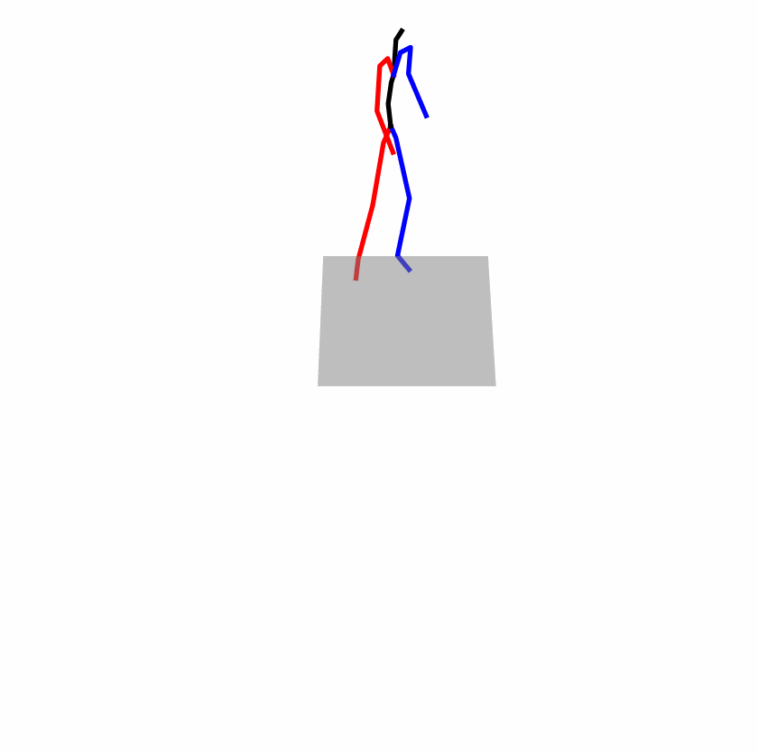
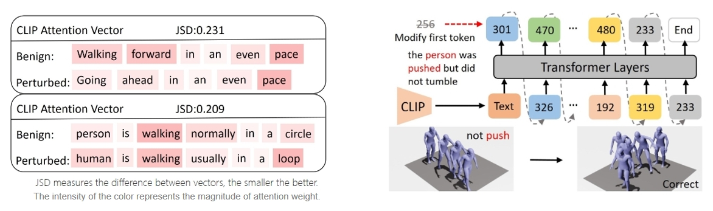
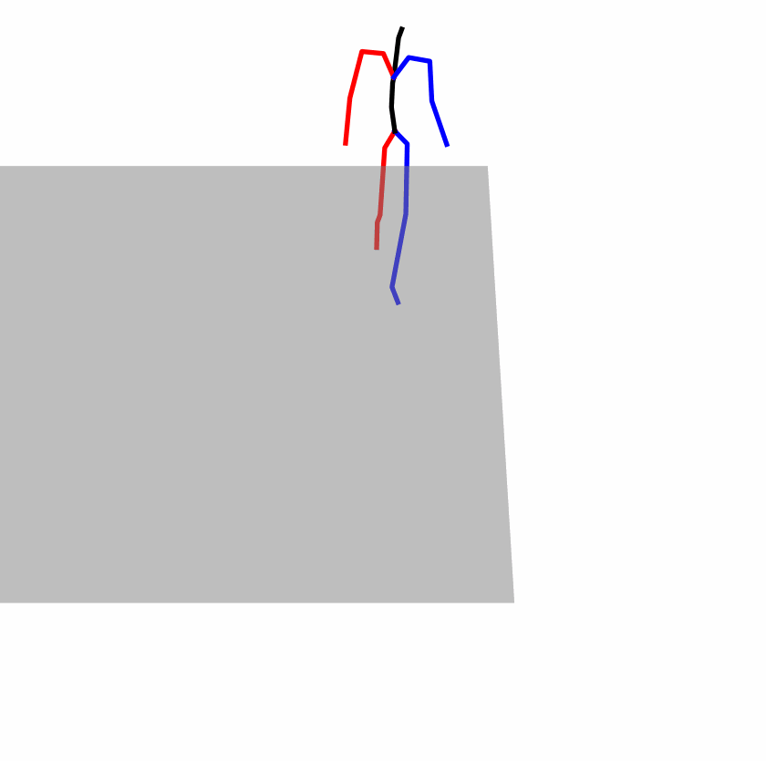
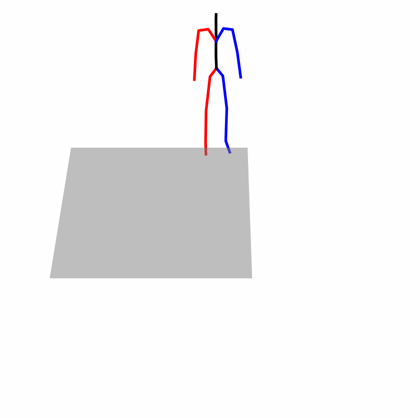
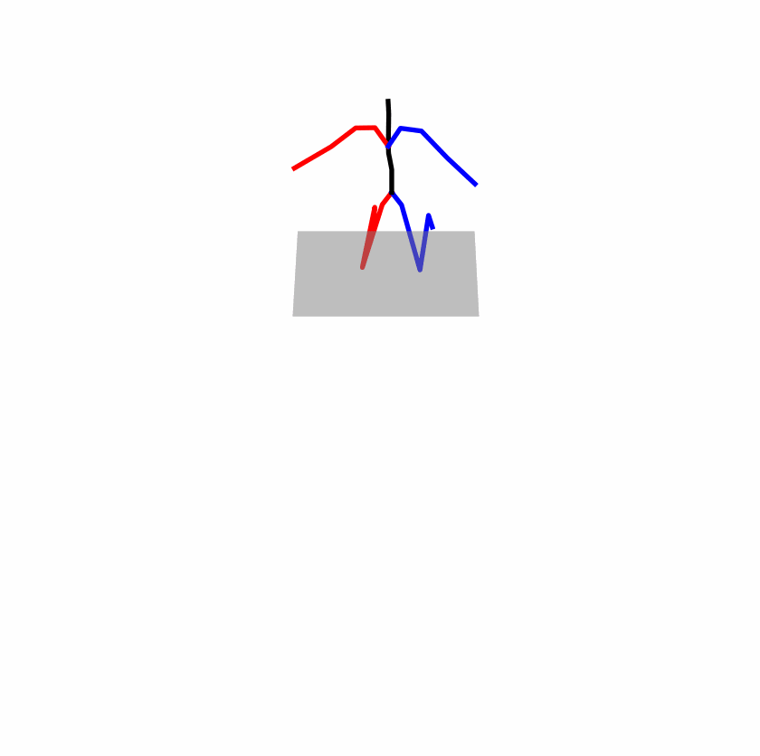
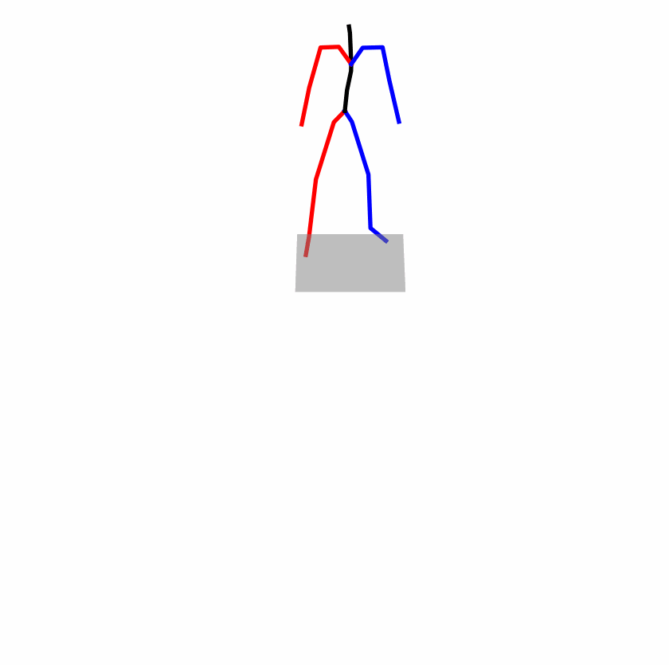
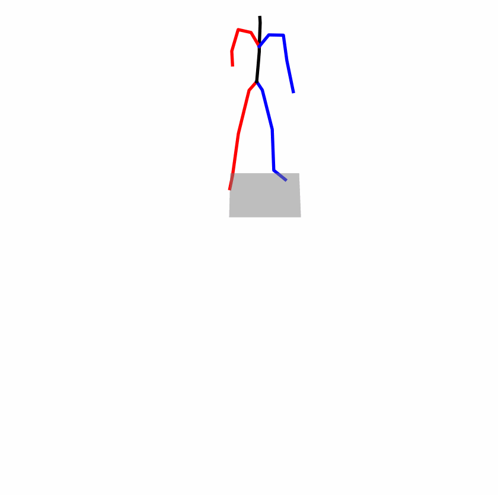

# SATO: Stable Text-to-Motion Framework

[Wenshuo chen*](https://github.com/shurdy123), [Hongru Xiao*](https://github.com/Hongru0306), [Erhang Zhang*](https://github.com/zhangerhang), [Lijie Hu](https://sites.google.com/view/lijiehu/homepage), [Lei Wang](https://leiwangr.github.io/), [Mengyuan Liu](https://www.semanticscholar.org/author/Mengyuan-Liu/47842072), [Chen Chen](https://www.crcv.ucf.edu/chenchen/)

[](https://sato-team.github.io/Stable-Text-to-Motion-Framework/) [](https://youtu.be/qqGhV3Flmus)  [](https://arxiv.org/abs/2405.01461)  
## Release
- [7/21] [SATO](https://arxiv.org/abs/2405.01461) is accepted by ACM MULTIMEDIA 2024 (ACM MM 24)!
## Existing Challenges
A fundamental challenge inherent in text-to-motion tasks stems from the variability of textual inputs. Even when conveying similar or the same meanings and intentions, texts can exhibit considerable variations in vocabulary and structure due to individual user preferences or linguistic nuances. Despite the considerable advancements made in these models, we find a notable weakness: all of them demonstrate instability in prediction when encountering minor textual perturbations, such as synonym substitutions. In the following demonstration, we showcase the instability of predictions generated by the previous method when presented with different user inputs conveying identical semantic meaning.
<!-- <div style="display:flex;">
    
    
</div> -->

<p align="center">
<table align="center">
  <tr>
    <th colspan="4">Original text: A man kicks something or someone with his left leg.</th>
  </tr>
  <tr>
    <th align="center"><u><a href="https://github.com/Mael-zys/T2M-GPT"><nobr>T2M-GPT</nobr> </a></u></th>
    <th align="center"><u><a href="https://guytevet.github.io/mdm-page/"><nobr>MDM</nobr> </a></u></th>
    <th align="center"><u><a href="https://github.com/EricGuo5513/momask-codes"><nobr>MoMask</nobr> </a></u></th>
  </tr>

  <tr>
    <td width="250" align="center"></td>
    <td width="250" align="center"></td>
    <td width="250" align="center"></td>
  </tr>

  <tr>
   <th colspan="4">Perturbed text: A human boots something or someone with his left leg.</th>

  </tr>
  <tr>
    <th align="center"><u><a href="https://github.com/Mael-zys/T2M-GPT"><nobr>T2M-GPT</nobr> </a></u></th>
    <th align="center"><u><a href="https://guytevet.github.io/mdm-page/"><nobr>MDM</nobr> </a></u></th>
    <th align="center"><u><a href="https://github.com/EricGuo5513/momask-codes"><nobr>MoMask</nobr> </a></u></th>
  </tr>

  <tr>
    <td width="250" align="center"></td>
    <td width="250" align="center"></td>
    <td width="250" align="center"></td>
  </tr>
</table>
</p>

## Motivation

The model's inconsistent outputs are accompanied by unstable attention patterns. We further elucidate the aforementioned experimental findings: When perturbed text is inputted, the model exhibits unstable attention, often neglecting critical text elements necessary for accurate motion prediction. This instability further complicates the encoding of text into consistent embeddings, leading to a cascade of consecutive temporal motion generation errors.
## Our Approach
<p align="center">
  
</p>

**Attention Stability**. For the original text input, we can easily observe the model's attention vector for the text. This attention vector reflects the model's attentional ranking of the text, indicating the importance of each word to the text encoder's prediction. We hope a stable attention vector maintains a consistent ranking even after perturbations.

**Prediction Robustness**. Even with stable attention, we still cannot achieve stable results due to the change in text embeddings when facing perturbations, even with similar attention vectors. This requires us to impose further restrictions on the model's predictions. Specifically, in the face of perturbations, the model's prediction should remain consistent with the original distribution, meaning the model's output should be robust to perturbations.

**Balancing Accuracy and Robustness Trade-off**. Accuracy and robustness are naturally in a trade-off relationship. Our objective is to bolster stability while minimizing the decline in model accuracy, thereby mitigating catastrophic errors arising from input perturbations. Consequently, we require a mechanism to uphold the model's performance concerning the original input.
## Quantitative evaluation on the HumanML3D and KIT-ML.

## Visualization
<p align="center">
<table align="center">
  <tr>
    <th colspan="4">Original text: person is walking normally in a circle.</th>
  </tr>
  <tr>
    <th align="center"><u><a href="https://github.com/Mael-zys/T2M-GPT"><nobr>T2M-GPT</nobr> </a></u></th>
    <th align="center"><u><a href="https://guytevet.github.io/mdm-page/"><nobr>MDM</nobr> </a></u></th>
    <th align="center"><u><a href="https://github.com/EricGuo5513/momask-codes"><nobr>MoMask</nobr> </a></u></th>
    <th align="center"><nobr>SATO</nobr> </th>
  </tr>

  <tr>
    <td width="250" align="center"></td>
    <td width="250" align="center"></td>
    <td width="250" align="center"></td>
    <td width="250" align="center"></td>
  </tr>

  <tr>
    <th colspan="4" >Perturbed text: <span style="color: red;">human</span> is walking <span style="color: red;">usually</span> in a <span style="color: red;">loop.</th>
  </tr>
  <tr>
    <th align="center"><u><a href="https://github.com/Mael-zys/T2M-GPT"><nobr>T2M-GPT</nobr> </a></u></th>
    <th align="center"><u><a href="https://guytevet.github.io/mdm-page/"><nobr>MDM</nobr> </a></u></th>
    <th align="center"><u><a href="https://github.com/EricGuo5513/momask-codes"><nobr>MoMask</nobr> </a></u></th>
    <th align="center"><nobr>SATO</nobr> </th>
  </tr>

  <tr>
    <td width="250" align="center"></td>
    <td width="250" align="center"></td>
    <td width="250" align="center"></td>
    <td width="250" align="center"></td>
  </tr>
</table>
</p>
<center>
  <h3>
    <p style="color: blue;">Explanation: T2M-GPT, MDM, and MoMask all don't walk in a loop.</p>
  </h3>

<p align="center">
<table align="center">
  <tr>
    <th colspan="4">Original text: a person uses his right arm to help himself to stand up.</th>
  </tr>
  <tr>
    <th align="center"><u><a href="https://github.com/Mael-zys/T2M-GPT"><nobr>T2M-GPT</nobr> </a></u></th>
    <th align="center"><u><a href="https://guytevet.github.io/mdm-page/"><nobr>MDM</nobr> </a></u></th>
    <th align="center"><u><a href="https://github.com/EricGuo5513/momask-codes"><nobr>MoMask</nobr> </a></u></th>
    <th align="center"><nobr>SATO</nobr> </th>
  </tr>

  <tr>
    <td width="250" align="center"></td>
    <td width="250" align="center"></td>
    <td width="250" align="center"></td>
    <td width="250" align="center"></td>
  </tr>

  <tr>
    <th colspan="4" >Perturbed text: A human <span style="color: red;">utilizes</span> his right arm to help himself to stand up.</th>
  </tr>
  <tr>
    <th align="center"><u><a href="https://github.com/Mael-zys/T2M-GPT"><nobr>T2M-GPT</nobr> </a></u></th>
    <th align="center"><u><a href="https://guytevet.github.io/mdm-page/"><nobr>MDM</nobr> </a></u></th>
    <th align="center"><u><a href="https://github.com/EricGuo5513/momask-codes"><nobr>MoMask</nobr> </a></u></th>
    <th align="center"><nobr>SATO</nobr> </th>
  </tr>

  <tr>
    <td width="250" align="center"></td>
    <td width="250" align="center"></td>
    <td width="250" align="center"></td>
    <td width="250" align="center"></td>
  </tr>
</table>
</p>
<center>
  <h3>
    <p style="color: blue;">Explanation: T2M-GPT, MDM, and MoMask all lack the action of transitioning from squatting to standing up, resulting in a catastrophic error.</p>
  </h3>

    
## How to Use the Code

* [1. Setup and Installation](#setup)

* [2.Dependencies](#Dependencies)

* [3. Quick Start](#quickstart)

* [4. Datasets](#datasets)

* [4. Train](#train)

* [5. Evaluation](#eval)

* [6. Acknowledgments](#acknowledgements)

    
## Setup and Installation <a name="setup"></a>

Clone the repository: 

```shell
git clone https://github.com/sato-team/Stable-Text-to-motion-Framework.git
```

Create fresh conda environment and install all the dependencies:

```
conda env create -f environment.yml
conda activate SATO
```

The code was tested on Python 3.8 and PyTorch 1.8.1.

## Dependencies<a name="Dependencies"></a>

```shell
bash dataset/prepare/download_extractor.sh
bash dataset/prepare/download_glove.sh
```

## **Quick Start**<a name="quickstart"></a>

A quick reference guide for using our code is provided in quickstart.ipynb.

## Datasets<a name="datasets"></a>

We are using two 3D human motion-language dataset: HumanML3D and KIT-ML. For both datasets, you could find the details as well as download [link](https://github.com/EricGuo5513/HumanML3D).
We perturbed the input texts based on the two datasets mentioned. You can access the perturbed text dataset through the following [link](https://drive.google.com/file/d/1XLvu2jfG1YKyujdANhYHV_NfFTyOJPvP/view?usp=sharing).
Take HumanML3D for an example, the dataset structure should look like this:  
```
./dataset/HumanML3D/
├── new_joint_vecs/
├── texts/ # You need to replace the 'texts' folder in the original dataset with the 'texts' folder from our dataset.
├── Mean.npy 
├── Std.npy 
├── train.txt
├── val.txt
├── test.txt
├── train_val.txt
└── all.txt
```
### **Train**<a name="train"></a>

We will release the training code soon.

### **Evaluation**<a name="eval"></a>

You can download the pretrained models in this [link](https://drive.google.com/drive/folders/1rs8QPJ3UPzLW4H3vWAAX9hJn4ln7m_ts?usp=sharing). 

```shell
python eval_t2m.py --resume-pth pretrained/vq_best.pth --resume-trans pretrained/net_best_fid.pth --clip_path pretrained/clip_best.pth
```

## Acknowledgements<a name="acknowledgements"></a>

We appreciate helps from :

- Open Source Code：[T2M-GPT](https://github.com/Mael-zys/T2M-GPT), [MoMask ](https://github.com/EricGuo5513/momask-codes), [MDM](https://guytevet.github.io/mdm-page/), etc.
- [Hongru Xiao](https://github.com/Hongru0306), [Erhang Zhang](https://github.com/zhangerhang), [Lijie Hu](https://sites.google.com/view/lijiehu/homepage), [Lei Wang](https://leiwangr.github.io/), [Mengyuan Liu](), [Chen Chen](https://www.crcv.ucf.edu/chenchen/) for discussions and guidance throughout the project, which has been instrumental to our work.
- [Zhen Zhao](https://github.com/Zanebla) for project website.
- If you find our work helpful, we would appreciate it if you could give our project a star!
## Citing<a name="citing"></a>

If you find this code useful for your research, please consider citing the following paper:

```bibtex
@misc{chen2024sato,
      title={SATO: Stable Text-to-Motion Framework}, 
      author={Wenshuo Chen and Hongru Xiao and Erhang Zhang and Lijie Hu and Lei Wang and Mengyuan Liu and Chen Chen},
      year={2024},
      eprint={2405.01461},
      archivePrefix={arXiv},
      primaryClass={cs.CV}
}
```

